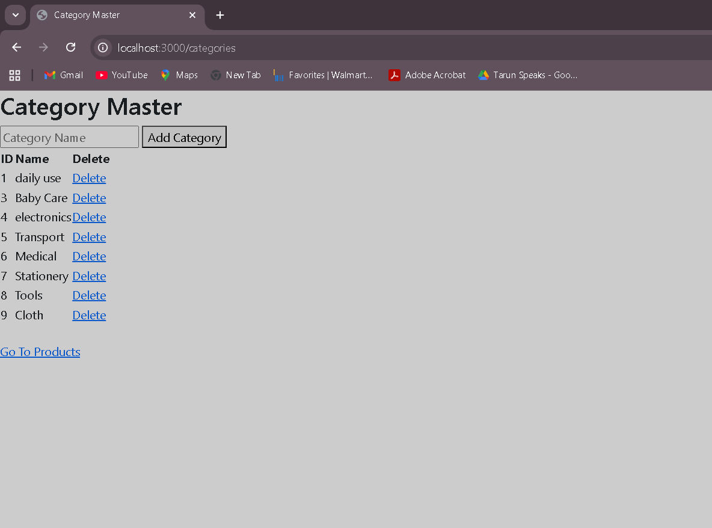
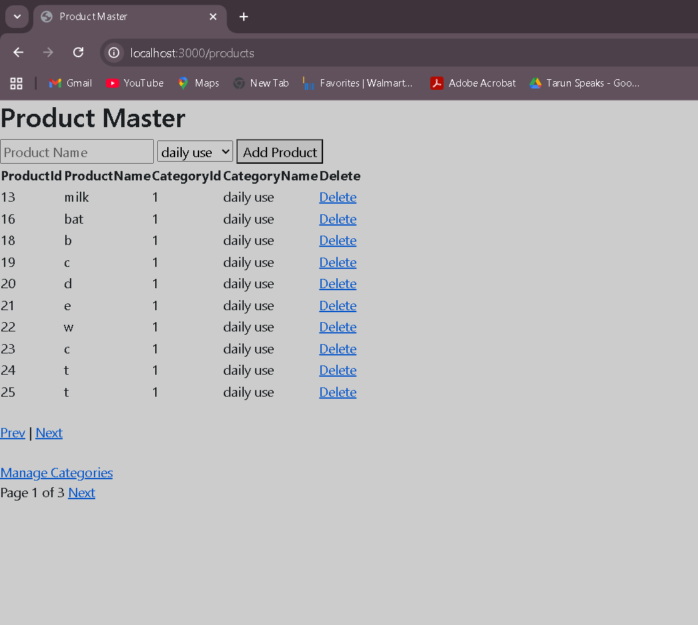
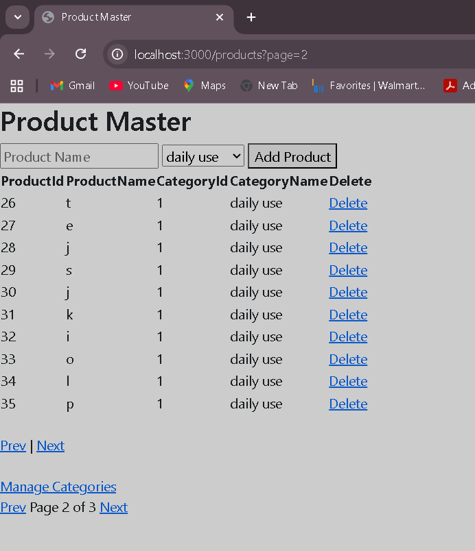

# NodeJS Machine Test – Category & Product Management System

## Overview

This project is a **Node.js + Express + MySQL CRUD application** developed as part of a machine test.

The application allows users to manage **Categories** and **Products**, where each product belongs to a category. The product list implements **server-side pagination**, meaning only the required records are fetched from the database for each page.

This ensures efficient database usage and scalable data retrieval.

---

# Tech Stack

Backend

* Node.js
* Express.js

Database

* MySQL

Template Engine

* EJS

Other Tools

* Bootstrap (via CDN for basic UI styling)

---

# Features

### Category Management

* Create Category
* View Category List
* Delete Category

### Product Management

* Create Product
* View Product List
* Delete Product

### Database Relationship

* Each product belongs to a category
* Implemented using **Foreign Key Constraint**

### Product List Display

The product list displays:

* ProductId
* ProductName
* CategoryId
* CategoryName

CategoryName is retrieved using **SQL JOIN**.

### Server Side Pagination

Pagination is implemented using **LIMIT and OFFSET**.

Example:

If page size = 10
If user requests page 9

The database query fetches:

```
LIMIT 10 OFFSET 80
```

Which retrieves records:

```
81 → 90
```

This ensures that only necessary data is retrieved from the database.

---
## Screenshots

### Categories Page



### Products Page


### Server-Side Pagination


---

# Project Structure

```
nimap_infotech_machine_test
│
├── server.js
├── app.js
├── db.js
├── package.json
├── README.md
│
├── database
│   └── schema.sql
│
├── controllers
│   ├── category.controller.js
│   └── product.controller.js
│
├── routes
│   ├── category.routes.js
│   └── product.routes.js
│
├── views
│   ├── categories.ejs
│   └── products.ejs
│

```

---

# Database Schema

Two tables are used in this application.

## Categories Table

```
categoryId (Primary Key)
categoryName
```

## Products Table

```
productId (Primary Key)
productName
categoryId (Foreign Key)
```

The **products table references the categories table** through a foreign key relationship.

---

# SQL Schema

Run the following SQL before starting the project.

```
CREATE TABLE categories (
  categoryId INT AUTO_INCREMENT PRIMARY KEY,
  categoryName VARCHAR(255) NOT NULL
);

CREATE TABLE products (
  productId INT AUTO_INCREMENT PRIMARY KEY,
  productName VARCHAR(255) NOT NULL,
  categoryId INT,
  FOREIGN KEY (categoryId) REFERENCES categories(categoryId)
);
```

---

# Installation & Setup

### 1 Install Dependencies

```
npm install
```

---

### 2 Setup Database

Create the database and run the SQL schema provided in:

```
database/schema.sql
```

Example database name:

```
nimap_infotech_test
```

---

### 3 Configure Database

Update database configuration in `.env` or `db.js`.

Example:

```
DB_HOST=localhost
DB_USER=root
DB_PASS=
DB_NAME=nimap_infotech_test
```

---

### 4 Start the Server

```
npm run dev
```

---

### 5 Open the Application

```
http://localhost:3000
```

---

# Application Routes

### Category Routes

```
GET /categories
POST /categories/add
GET /categories/delete/:id
```

### Product Routes

```
GET /products
POST /products/add
GET /products/delete/:id
```

### Pagination

```
/products?page=2
/products?page=3
```

---

# Example Workflow

1. Create categories
2. Create products under categories
3. View products list with category name
4. Navigate pages using pagination

---

# Key Backend Concepts Used

* REST-style routing
* MVC structure (Routes → Controllers → Database)
* SQL JOIN
* Foreign Key constraints
* Server-side pagination
* Express middleware
* Template rendering with EJS

---

# Author

Swayam Gupta

---

# Notes

This project was created as part of a machine test to demonstrate backend development skills using Node.js and MySQL, including relational database design and efficient data retrieval using server-side pagination.
